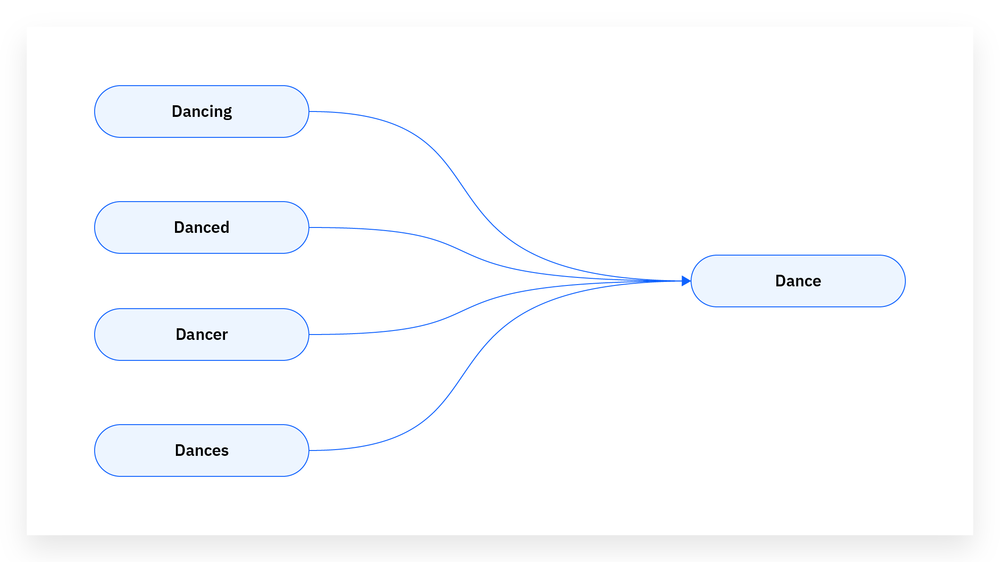

# Introducción a la Programación con Python y NLP

## Instructor
Dr. Jorge Cein Villanueva Guzmán

## Objetivo del taller
Desarrollar la capacidad de implementar aplicaciones prácticas de Inteligencia Artificial aplicadas al procesamiento de lenguaje natural (NLP) usando Python y librerías especializadas.

---
## Mi Primer Código python

```python
def hola_mundo():
    print("¡Hola desde Python!")
    return "Éxito"
```
---
<style scoped>
section {
  font-size: 28px;
}
h1 {
  font-size: 52px;
}
</style>
# ¿Que es el Procesamiento de Lenguaje Natural?
- Es un subcampo de la IA que se centra en la interacción entre las computadoras y los humanos a través del lenguaje natural.
- El objetivo final del PLN es permitir que las computadoras comprenda, interpreten y generen lenguajes humanos de una manera que sea tanto significativa como útil.


---
# Aplicaciones del PLN
- **Motores de búsqueda**: Fundamental para interpretar y comprender las consultas de los usuarios. P.E. Google lo utiliza para comprender el contexto y la intencipon detras de las consultas de búsqueda.
- **Traducción Automática**: Las técnicas de PLN ayudan a comprtender la semántica y la sintaxis del idioma origen y traducirlo com precisión al idioma de destino.
- **Chatbots y Asistentes Virtuales**:El PLN potencia las habilidades conversacionales de chatbots y asistentes virtuales. Estos sistemas usan el PLN para comprender el lenguaje natural de los usuarios y generar respuestas apropiadas.
- **Análisis de sentimientos**: Uso de PLN para analizar comentarios de clientes, reseñas y publicaciones en redes sociales para evaluar la opinión pública y el sentimiento sobre sus productos o servicios.

---
# Aplicaciones del PLN

- **Resumen de textos**: Las técnicas de PLN se utilizan para generar automáticamente resúmenes de documentos extensos.
- **Detección de Spam**: Los servicios de correo electrónico utilizan el PLN para identificar y filtrar mensajes de spam.
- **Reconocimiento de voz**: Uso de PLN para conversión de lenguaje hablado a texto escrito.
- **Sistemas de Recomendación**: Netflix y Amazon usan PLN para analizar reseñas y comentarios de usuarios y recomendar películas, libros y más.
- **Salud**: Análisis de registros de pacientes, documentos de investigación y notas clínicas. 
- **Tecnología legal**: Uso por parte de bufetes de abogados para revisar y analizar documentos legales, contratos y jurisprudencia.

---
# Conceptos fundamentales de PLN
- **Tokenización**: Proceso de dividir un texto en sus unidades mínimas de análisis (palabras, frases o caracteres). Ejemplo: “La IA es poderosa” → [“La”, “IA”, “es”, “poderosa”].
- **Lematización y stemming**: 
  - *Stemming*: reducción de una palabra a su raíz (ejemplo: “programando”, “programar” → “program”).
  - *Lematización*: proceso más avanzado que transforma la palabra a su forma base considerando el contexto gramatical (ejemplo: “mejores” → “mejor”).
- **Stopwords**: Palabras muy comunes (como “el”, “de”, “y”) que suelen eliminarse en tareas de NLP porque no aportan valor semántico al análisis.
- **Vectorización de texto**: Representar palabras o frases en un formato numérico que las máquinas puedan procesar. Ejemplos:
  - *Bag of Words (BoW)*
  - *TF-IDF* (Term Frequency - Inverse Document Frequency)
  - *Embeddings* (representaciones densas de palabras en espacios vectoriales).
---
# Evolucion de modelos en PLN
1. ***Métodos estadísticos (1990-2010)***
Se basaban en probabilidades y conteo de palabras. Eran limitados en comprensión semántica.

2. ***Modelos neuronales y Word Embeddings (2013-2017)***
Con Word2Vec y GloVe se introdujo la representación semántica de palabras, lo que permitió entender similitudes y relaciones.

3. ***Transformers (2017-presente)***
Propuestos en el artículo Attention is All You Need (Vaswani et al., 2017), revolucionaron el campo gracias al mecanismo de self-attention.
Modelos como BERT, GPT y T5 permiten comprender y generar texto de manera fluida, contextualizada y precisa.

---
# Librerias en Python para NLP
- **NLTK (Natural Language Toolkit)**: la biblioteca más antigua para análisis lingüístico, con herramientas para tokenización, stemming, POS tagging y parsers.
- **spaCy**: rápida, moderna, y enfocada en aplicaciones prácticas. Tiene modelos en español, inglés y otros idiomas.
- **Transformers (HuggingFace)**: permite usar modelos preentrenados con solo unas líneas de código. Ejemplo: resumen automático, generación de texto o clasificación.
- **Datasets**: librería que conecta con corpus listos para entrenar y evaluar modelos.

---
# Tokenización en PLN
- Es el proceso de dividr el texto en unidades mas pequeñas, llamadas tokens.
- Los tokens pueden ser palabras, frases o incluso caracteres.
- Es un paso fundamental en el procesamiento de texto.
---
# Ejemplo de tokenización
Uso de la biblioteca **nltk** para tokenizar un texto muestra. Se instala con el comando:
```bash
pip install nltk
```
```python
import nltk
nltk.download('punkt')
# nltk.download('all')

#Función para dividir el texto en palabras
from nltk.tokenize import word_tokenize
# Texto de ejemplo
texto = "La inteligencia artificial está transformando el mundo."
# Tokenización del texto mediante la función word_tokenize
tokens = word_tokenize(texto)

# Impresión de la lista de tokens
print(tokens)
```
---
# Significado de la tokenización:
- **Procesamiento de texto**: La tokenización es el primer paso en muchas tareas de PLN, incluyendo análisis de texto, traducción automática, análisis de sentimientos y más.
- **Preparación de datos**: Al dividir el texto en tokens, se facilita realizar análisis adicionales como la distribución de frecuencias, el etiquetado de partes del discurso y más.
- **Simplificación**:La tokenización simplifica el texto complejo en piezas manejables, lo que facilita el procesamiento y análsiis por porte de los algoritmos.

---
# Ejemplo de traducción automática
```bash
pip install translate
```
```python
#Importar el módulo Translator de la biblioteca translate
from translate import Translator

# Crear un objeto translator especificando el idioma destino
translator = Translator(to_lang="es")
# Traducción de una frase
translation = translator.translate("How are you?")
print(translation)  # Output: ¿Cómo estás?
```
---
## Ejemplo de análisis de sentimientos con TextBlob
```bash
pip install textblob
```
```python
from textblob import TextBlob
# Texto de ejemplo
text = "I love this product! It's amazing."
# Creando un objeto TextBlob
blob = TextBlob(text)
# analisis de sentimientos
sentiment = blob.sentiment
print(sentiment)  # Output: Sentiment(polarity=0.65, subjectivity=0.6)
```
- Polarity(Polaridad): Varía entre -1 a 1, -1 indica un sentimiento muy negativo, 0 indica sentimiento neutral y 1 indica un sentimiento muy positivo.
- Subjectivity(Subjectividad): De 0 a 1. 0 indica una declaración objetiva (basada en hechos) y 1 indica una declaración altamente subjetiva (basada en opiniones).
---
## Ejemplo de análisis de sentimientos con transformers
```bash
pip install -U transformers torch
```
```python
from transformers import pipeline
# Modelo multilingüe con etiquetas de 1 a 5 estrellas
analizador = pipeline("sentiment-analysis", model="nlptown/bert-base-multilingual-uncased-sentiment")

texto = "Me gusto este producto; la calidad es excelente y el envío fue muy rápido."
resultado = analizador(texto)[0]
print("Texto:", texto)
print("Etiqueta del modelo:", resultado['label'])  # '5 stars', '4 stars', etc.
print("Confianza:", round(resultado['score'], 3))
# Normalización a positivo/neutral/negativo (opcional)
label = resultado['label']
if label in ["4 stars", "5 stars"]:
    etiqueta = "positivo"
elif label in ["1 star", "2 stars"]:
    etiqueta = "negativo"
else:
    etiqueta = "neutro"
print("Etiqueta (simplificada):", etiqueta)
```
---
# Limpieza de texto

La eliminación de texto es crucial en el pipeline de preprocesamiento de texto, sirviendo como la base sobre la cual se construye el análisis y la modelización.

Transformación importante porque:
- El texto sin procesar puede contener numerosas inconsistencias
- Información irrelevante
- Ruido que puede dificultar el rendimiento de los modelos de PLN

La eliminación de palabras vacías implica:
- Identificar y eliminar palabras comunes que aportan poco valor semántico al texto, ("y","el","en")
- Ayuda a reducir la dimensionalidad de los datos y a enfocarse en las palabras mas significativas.
---
## Stemming

**Steamming**: Proceso de reducir las palabras a su forma base o raíz, eliminando sufijos, prefijos u otros afijos. P.E. "corriendo" y "corredor" se reducen a su forma raíz "correr".

El algoritmo más utilizado es el Porter Stemmer, desarrollado por Martin Porter en 1980. Este algoritmo aplica una serie de reglas para transformar palabras en sus raíces.



---
## Ejemplo de Stemming en Python
```python
from nltk.stem import PorterStemmer

# Texto muestra
text = "Natural Language Processing enables computers to understand human language."

# Tokenizar el texto. Proceso de descomponer el texto en unidades mas pequeñas
tokens = text.split()

# Inicializar  el stemmer. 
stemmer = PorterStemmer()

# A la instancia creada se le aplicará stemming a cada token
stemmed_tokens = [stemmer.stem(word) for word in tokens]

print("Original Tokens:")
print(tokens)

print("\\nStemmed Tokens:")
print(stemmed_tokens)
```
---
## Aplicación de Stemming
1. ***Motores de búsqueda***. El motor puede encontrar cualquier forma del término de búsqueda, ampliando y mejorando los resultados de la misma.
   
2. ***Clasificación de texto***. Al reducir la dimensionalidad del texto, mejora el rendimiento de los algoritmos de clasificación.
   
3. ***Análisis de sentimientos***. Asegura que diferentes formas de una palabra no distorsionen los resultados del análisis de sentimientos.

---
## Lematización
Es una técnica crucial en el procesamiento de lenguaje natural (PLN) que transforma palabras en su forma base o raíz, conocida como **lema**.

Similar a stemming, reduce las palabras a su forma base o de diccionario, conocida como lema. A diferencia de stemming, analiza el significado, estructura gramátical y considera el contexto, por ejemplo: "mejor" se lematizaría a "bueno", "better" se lematizaría a "good".

Implica usar un diccionario y análisis morfológico para devolver la forma base de las palabras.

---
## Ejemplo 1 en Python con NLTK
```python
from nltk.stem import WordNetLemmatizer
import nltk
nltk.download('wordnet')
nltk.download('omw-1.4')

# Sample text
text = "Natural Language Processing enables computers to understand human language."

# Tokenize the text
tokens = text.split()

# Initialize the lemmatizer
lemmatizer = WordNetLemmatizer()

# Lemmatize the tokens
lemmatized_tokens = [lemmatizer.lemmatize(word) for word in tokens]

print("Original Tokens:")
print(tokens)

print("\\nLemmatized Tokens:")
print(lemmatized_tokens)
```
---
## Ejemplo 2 con spacy
```python
import spacy
nlp = spacy.load("es_core_news_sm")

doc = nlp("Los estudiantes están programando aplicaciones inteligentes.")
for token in doc:
    print(token.text, "→", token.lemma_)
```
---
## Diferencias entre Stemming y Lematización

| Característica | Stemming                               | Lematización                   |
| -------------- | -------------------------------------- | ------------------------------ |
| Método         | Basado en reglas simples o heurísticas | Basado en análisis morfológico |
| Precisión      | Menor                                  | Mayor                          |
| Velocidad      | Alta                                   | Media                          |
| Resultado      | Puede no ser palabra válida            | Siempre produce palabra válida |

---
## Principales aplicaciones de Lematización

- Motores de búsqueda (search engines).

- Análisis de sentimientos (identificar emociones sin importar conjugaciones).

- Clasificación de textos académicos o legales.

Mas información: [¿Qué son el stemming y la lematización?](https://www.ibm.com/mx-es/think/topics/stemming-lemmatization)

---
# Stopwords
Las stopwords son palabras muy comunes en un idioma (como “el”, “de”, “en”, “que”) que generalmente no aportan información útil para el análisis semántico.
Eliminar estas palabras permite concentrarse en los términos que realmente expresan el contenido.

## Características

- Varían según el idioma y el contexto (en textos legales o científicos, algunas stopwords pueden tener valor informativo).
- Su eliminación reduce el tamaño de los vectores y acelera los cálculos.
---
## Ejemplo en Python
```python
import nltk
from nltk.corpus import stopwords
nltk.download('stopwords')

# Sample text
text = "Natural Language Processing enables computers to understand human language."
# Tokenize the text
tokens = text.split()
# Remove stop words
stop_words = set(stopwords.words('english'))
filtered_tokens = [word for word in tokens if word.lower() not in stop_words]

print("Original Tokens:")
print(tokens)

print("\\nFiltered Tokens:")
print(filtered_tokens)
```
---
## Aplicaciones

- Limpieza de texto para machine learning.

- Preparación de datos para análisis de tópicos (topic modeling).

- Reducción de ruido en resúmenes automáticos.
---
# Etiquetado gramatical (POS Tagging)
- Part-of-Speech Tagging (POS) consiste en asignar a cada palabra su categoría gramatical: sustantivo, verbo, adjetivo, etc.
- Permite comprender la estructura sintáctica de una oración.
Ejemplo:

“El perro corre rápido.”
→ [El/DET] [perro/NOUN] [corre/VERB] [rápido/ADV]

## Características

- Utiliza reglas lingüísticas o modelos estadísticos.
- Es clave para entender la función de cada palabra en el texto.
---
## Ejemplo en python
```python
doc = nlp("Los sistemas inteligentes procesan lenguaje humano.")
for token in doc:
    print(token.text, token.pos_)
```
### Resultado:
```bash
Los DET
sistemas NOUN
inteligentes ADJ
procesan VERB
lenguaje NOUN
humano ADJ
. PUNCT

```
---
## Aplicaciones de Part-of-Speech Tagging (POS)

- Traducción automática.

- Análisis sintáctico (gramatical).

- Extracción de entidades y relaciones entre conceptos.

---
# Reconocimiento de Entidades Nombradas (NER)
El Named Entity Recognition (NER) identifica nombres propios en un texto, como personas, organizaciones, lugares, fechas, etc.

Ejemplo:

“OpenAI fue fundada en 2015 en San Francisco.”
  [OpenAI/ORG], [2015/DATE], [San Francisco/LOC]

## Características

- Se basa en modelos estadísticos entrenados con corpus etiquetados.
- Puede adaptarse a dominios específicos (médico, financiero, educativo).
---
# Código de ejemplo en python
```python
doc = nlp("Google fue fundada por Larry Page y Sergey Brin en California.")
for ent in doc.ents:
    print(ent.text, ent.label_)
```
### Resultado:
```bash
Google ORG
Larry Page PER
Sergey Brin PER
California LOC
```
----
# Aplicaciones de Reconocimiento de Entidades Nombradas (NER)

- Extracción de información en documentos legales o científicos.

- Análisis de medios y redes sociales.

- Sistemas de recomendación personalizados.
---
# Resumen de Texto
Es una técnica valiosa que tiene como objetivo generar un resumen conciso y coherente de un texto mas extenso.
Retiene la información mas importante y los puntos claves, mientras que reduce significativamente la cantidad de texto que necesita ser leído.
Resumen extractivo: se basa en identificar las oraciones más importantes dentro de un texto y unirlas para formar un resumen.
Resumen abstractivo: se acerca más a la forma en que los humanos suelen resumir el texto. 

---
## Ejemplo en Python
```python
from transformers import pipeline

resumen = pipeline("summarization", model="facebook/bart-large-cnn")
texto = """La inteligencia artificial está transformando sectores como la medicina, la educación y la industria.
Permite optimizar procesos y crear soluciones innovadoras que mejoran la calidad de vida."""
print(resumen(texto, max_length=40, min_length=15, do_sample=False))
```
---
# Chatbots

Es una sofisticada aplicación para simular una conversación humana a través de interacciones de texto o voz.

- Emplean técnicas avanzadas de procesamiento del lenguaje natural (NLP) para interpretar y responder con precisión a las entradas de los usuarios.

- Pueden integrarse en diversas plataformas (sitios web, mensajería, aplicaciones móviles).
---
## Tipos de chatbots
- **Basados en reglas**. Operan en función de un conjunto de reglas y patrones predefinidos. Siguen un guión para responder a entradas específicas. Usado para tareas simples: ***responder preguntas frecuentes, proporcionar información básica ***
- **Autoaprendizaje**. También conocidos como chatbots impulsados por IA. Emplean algoritmos de aprendizaje automático para entender y generar respuestas. Pueden manejar interacciones más complejas y mejorar con el tiempo al aprender de las entradas de usuarios.
- **Híbrido**. Combinan enfoques basados en reglas y autoaprendizaje para aprovechar las fortalezas de ambos.
---
## Ejemplo de chatbot simple basado en reglas
```python
def chatbot_response(user_input):
    responses = {
        "hello": "Hello! How can I assist you today?",
        "hi": "Hi there! What can I do for you?",
        "how are you?": "I'm just a chatbot, but I'm here to help you!",
        "what is your name?": "I am ChatBot, your virtual assistant.",
        "bye": "Goodbye! Have a great day!"
    }

    user_input = user_input.lower()
    return responses.get(user_input, "I'm sorry, I don't understand that. Can you please rephrase?")

# Test the chatbot
while True:
    user_input = input("You: ")
    if user_input.lower() == "exit":
        print("ChatBot: Goodbye! Have a great day!")
        break
    response = chatbot_response(user_input)
    print(f"ChatBot: {response}")
```
---
